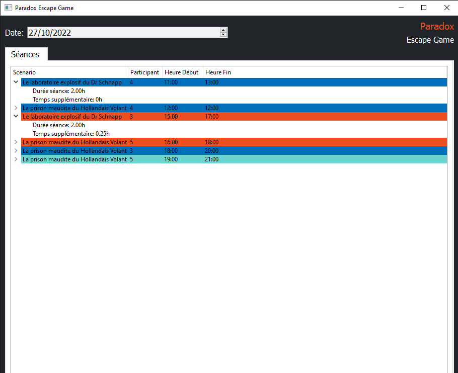

# Escape Game

Ce projet est un outil de surveillances des parties d'Escape Game.

Il est constitué de 3 parties à savoir : 
- une application web : reservations des séances
- une application mobile : lancement des parties
- une application desktop : surveillances des parties

Le projet desktop Escape Game consiste au développement d'une application Qt en python.
Ce projet recense les séances d'escape Game prévues pour la date du jour dans une liste.
Les parties terminées sont affichées en bleu foncé et les parties dont le temps réglementaire est dépassé sont affichées en rouge.

## Pré-requis

Pour l'application desktop : 
- [Python](https://www.python.org/downloads/) : interface
- [PostGreSQL 15](https://www.postgresql.org/download/) : SGBD


## Installation

- A la racine du projet, lancez les commandes 
```python
pip install virtualenv
python -m venv env
./env/Scripts/activate
pip install -r requirements.txt
```

## Utilisation

Commandes pour lancer l'interface Qt
```python
python main.py
```


## Visuel de l'application

**Lister les parties**



